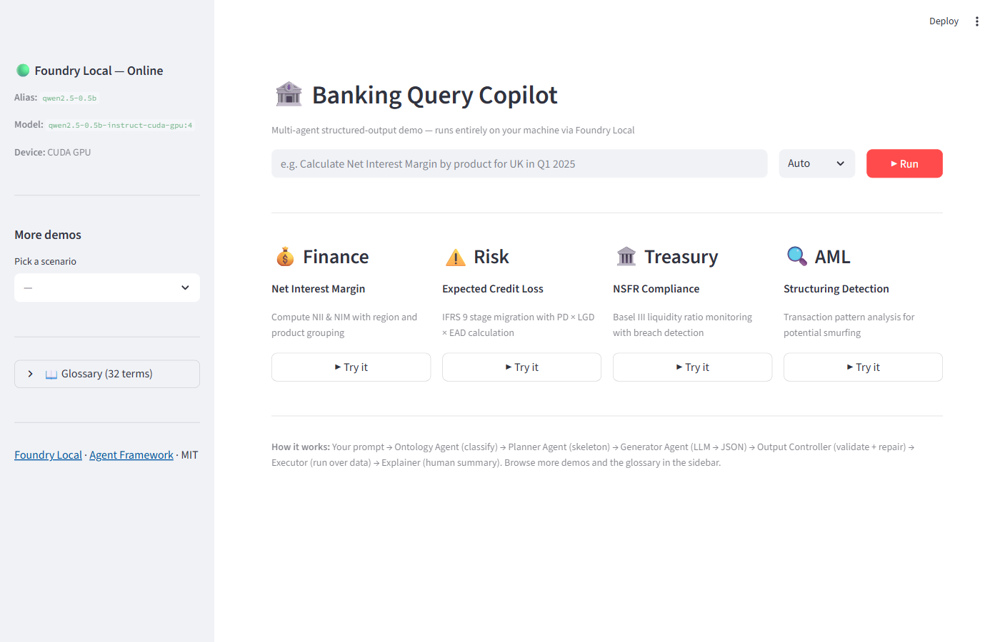
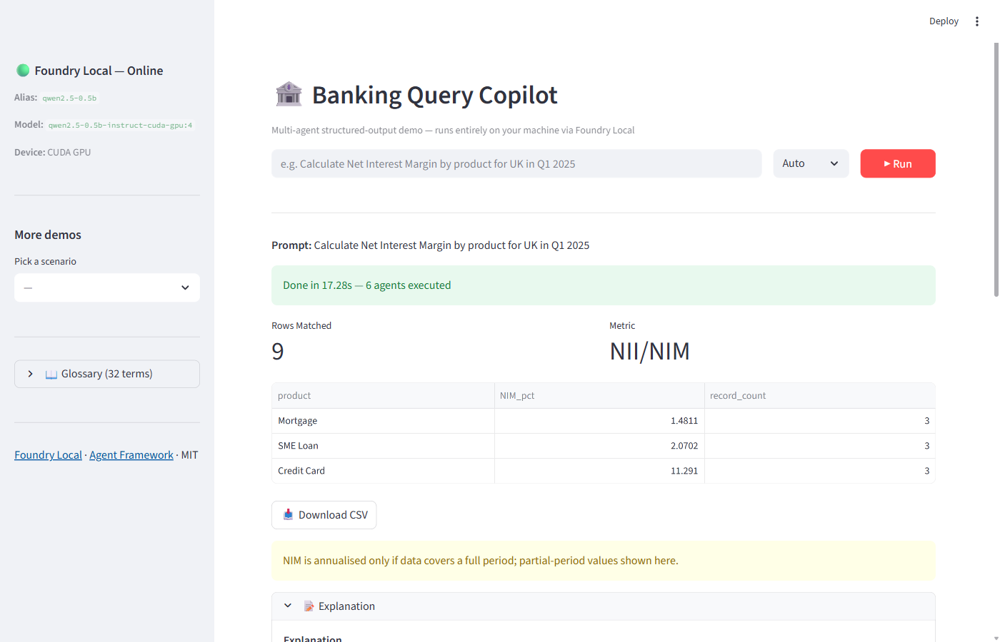
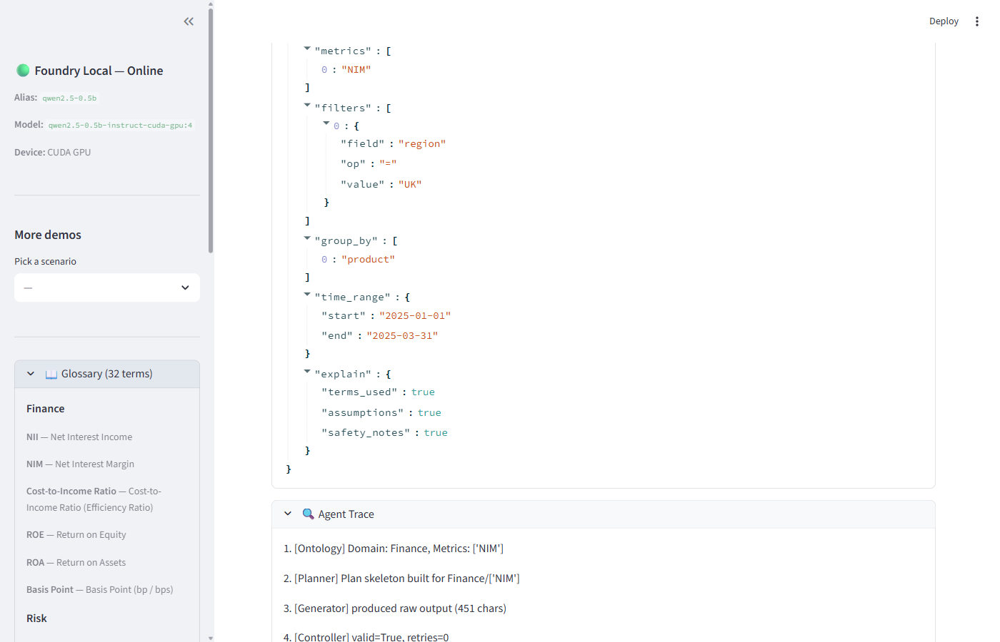

# 🏦 Bankquery Copilot Foundry Local

[](https://learn.microsoft.com/en-us/azure/ai-foundry/foundry-local/get-started)
[](https://github.com/microsoft/agents)
[](LICENSE)
[](https://python.org)
[](tests/)

**Multi-agent banking analytics copilot** with strict structured-output control, running **fully local** on [Microsoft Foundry Local](https://learn.microsoft.com/en-us/azure/ai-foundry/foundry-local/get-started).

Demonstrates how a **small local model** (e.g. Qwen 2.5 0.5B) can achieve large-model-like reliability by combining:

1. **Strict structured output control** — JSON Schema validation + repair loop
2. **Multi-agent orchestration** — Microsoft Agent Framework patterns (Coordinator → specialist agents)
3. **Deterministic execution** — Query plans run over local JSON data (no databases, no SQL)

---

## Screenshots

### Landing Page — Domain demo cards



### Finance Demo — Net Interest Margin results



### Treasury Demo — NSFR compliance with breach detection


### Query Plan & Agent Trace


### Sidebar — Glossary (32 financial terms)



---

## Quick Start

### Prerequisites

- **Python 3.10+**
- **Foundry Local** (for model inference — see below)

### 1. Clone and set up

```bash
git clone <repo-url> bankquery-copilot-local
cd bankquery-copilot-local

python -m venv .venv

# Windows
.venv\Scripts\activate

# macOS/Linux
source .venv/bin/activate

pip install -r requirements.txt
```

### 2. Install Foundry Local

**Windows:**
```bash
winget install Microsoft.FoundryLocal
```

**macOS:**
```bash
brew tap microsoft/foundrylocal
brew install foundrylocal
```

### 3. One-command demo (recommended)

Use the startup script to load the model and launch the app in one step:

**Windows (PowerShell):**
```powershell
.\start.ps1
```

**Windows (CMD):**
```cmd
start.bat
```

**macOS / Linux:**
```bash
chmod +x start.sh
./start.sh
```

The script will:
1. Activate the virtual environment
2. Verify Foundry Local is installed
3. Load the model into Foundry Local (with a 15-minute TTL)
4. Start the Streamlit app at `http://localhost:8501`

### 4. Manual start

If you prefer to start each component separately:

**Load a model:**
```bash
foundry model run qwen2.5-0.5b
```

**Run the app:**
```bash
streamlit run app.py
```

The app automatically discovers the Foundry Local endpoint (dynamic port).
You can override it with an environment variable if needed:

```bash
# Optional — override auto-discovery
set FOUNDRY_LOCAL_ENDPOINT=http://127.0.0.1:5273/v1
set MODEL_NAME=qwen2.5-0.5b
```

### 5. Run without Foundry Local (demo mode)

To run the demo without a live model (uses deterministic fixtures):

```bash
set MOCK_MODE=1
streamlit run app.py
```

---

## Running Tests

```bash
# Tests always run in mock mode (no Foundry dependency)
pytest tests/ -v
```

---

## Project Structure

```
bankquery-copilot-local/
├── app.py                          # Streamlit UI
├── start.bat                       # One-command demo (Windows CMD)
├── start.ps1                       # One-command demo (PowerShell)
├── start.sh                        # One-command demo (macOS/Linux)
├── requirements.txt                # Python dependencies
├── pyproject.toml                  # Project metadata
├── LICENSE                         # MIT License
├── SECURITY.md                     # Security policy
├── CONTRIBUTING.md                 # Contribution guidelines
│
├── agents/                         # Multi-agent pipeline
│   ├── base.py                     # Base agent class + message envelope
│   ├── coordinator_agent.py        # Top-level orchestrator
│   ├── ontology_agent.py           # Financial term → metric mapping
│   ├── planner_agent.py            # Deterministic plan skeleton builder
│   ├── generator_agent.py          # LLM-based QueryPlan generator
│   ├── output_controller_agent.py  # Schema validation + repair loop
│   ├── executor_agent.py           # Deterministic execution wrapper
│   └── explainer_agent.py          # Human-readable explanation generator
│
├── core/                           # Shared utilities
│   ├── foundry_client.py           # Foundry Local OpenAI client + mock fallback
│   ├── executor.py                 # Deterministic query execution engine
│   └── schema_validate.py          # JSON Schema validation + repair helpers
│
├── schemas/
│   └── query_plan.schema.json      # QueryPlan JSON Schema
│
├── data/                           # Local JSON demo datasets
│   ├── glossary.json               # Financial terms glossary (32 terms)
│   ├── interest.json               # Interest income/expense data
│   ├── loans.json                  # IFRS 9 loan staging data
│   ├── liquidity.json              # NSFR liquidity data
│   ├── transactions.json           # Transaction records
│   └── thresholds.json             # Cash reporting thresholds
│
├── demo/
│   └── demo_prompts.jsonl          # Curated demo prompts
│
└── tests/
    ├── conftest.py                 # Shared fixtures
    ├── test_schema.py              # Schema validation tests
    ├── test_executor.py            # Execution correctness tests
    └── test_repair.py              # Repair loop + end-to-end tests
```

---

## How It Works

### Agent Pipeline

```
User Prompt
    │
    ▼
┌─────────────────────┐
│  CoordinatorAgent    │  Routes through specialist agents
└─────────┬───────────┘
          │
    ┌─────▼──────────────────┐
    │  FinancialOntologyAgent│  Classifies domain, identifies metrics
    └─────┬──────────────────┘
          │
    ┌─────▼──────────────────┐
    │  QueryPlannerAgent     │  Builds plan skeleton (deterministic)
    └─────┬──────────────────┘
          │
    ┌─────▼──────────────────┐
    │  QueryPlanGeneratorAgent│  LLM generates full JSON QueryPlan
    └─────┬──────────────────┘
          │
    ┌─────▼──────────────────┐
    │  OutputControllerAgent │  Validates against schema; repair loop (max 2)
    └─────┬──────────────────┘
          │
    ┌─────▼──────────────────┐
    │  ExecutorAgent         │  Deterministic execution over JSON files
    └─────┬──────────────────┘
          │
    ┌─────▼──────────────────┐
    │  ExplainerAgent        │  Human-readable explanation + safety notes
    └─────────────────────────┘
```

### Output Control Strategy

1. The model receives the full JSON Schema in its system prompt
2. A plan skeleton (built deterministically) guides the model
3. Low temperature (0.1) and capped max_tokens reduce drift
4. `OutputControllerAgent` validates the output against the schema
5. On failure: a **repair prompt** with error details is sent (max 2 retries)
6. If still invalid: a schema-conforming **error object** is returned

---

## Demo Scenarios

| # | Domain | Prompt | Metrics |
|---|--------|--------|---------|
| 1 | Finance | "Calculate Net Interest Margin by product for UK in Q1 2025" | NII, NIM |
| 2 | Finance | "What is the net interest income for mortgages in Q1 2025?" | NII |
| 3 | Finance | "Compare Net Interest Income across all regions for January 2025" | NII |
| 4 | Risk | "Show loans migrated from Stage 1→2 in last 30 days, compute ECL" | ECL |
| 5 | Risk | "Calculate ECL for all Stage 2 loans in the UK" | ECL |
| 6 | Risk | "Show average PD by product for UK Stage 2 loans" | ECL |
| 7 | Treasury | "Show monthly NSFR trend, flag months below 100%" | NSFR |
| 8 | Treasury | "Is our NSFR above the regulatory minimum this quarter?" | NSFR |
| 9 | Treasury | "What is our total available stable funding for UK in Q1 2025?" | NSFR |
| 10 | AML | "Find customers with repeated cash deposits near thresholds within 7 days" | STRUCTURING_FLAG |
| 11 | AML | "Flag any potential structuring activity on cash deposits in the last week" | STRUCTURING_FLAG |
| 12 | AML | "Flag transactions that may warrant a SAR filing based on structuring patterns" | STRUCTURING_FLAG |

---

## Key Formulas

| Metric | Formula |
|--------|---------|
| **NII** | interest_income − interest_expense |
| **NIM** | NII / avg_earning_assets × 100 |
| **ECL** | PD × LGD × EAD |
| **NSFR** | available_stable_funding / required_stable_funding × 100 |
| **Structuring** | cash deposits ≥ 90% of threshold, count ≥ N in sliding window |

---

## Financial Terms Glossary

The repo ships a **32-term glossary** at [`data/glossary.json`](data/glossary.json) covering industry-standard terminology used at firms like Morgan Stanley, JPMorgan, and HSBC. Each entry includes:

| Field | Description |
|-------|-------------|
| `term` | Short code (e.g. NIM, ECL, NSFR) |
| `full_name` | Canonical name |
| `domain` | Finance / Risk / Treasury / AML |
| `definition` | Plain-English definition |
| `formula` | Computation formula |
| `dataset` | Which local JSON file the term maps to |
| `synonyms` | Alternate terms the model should recognise |
| `example_prompt` | Ready-to-use prompt for testing |
| `regulatory_context` | Relevant regulation (Basel III, IFRS 9, BSA, etc.) |

### Using the Glossary

- **In the UI:** The sidebar has a Glossary browser — select a domain, pick a term, and click "Use example prompt" to auto-fill the prompt box.
- **For prompt validation:** Use the `example_prompt` field to test that the model correctly classifies domain and selects the right metrics.
- **For prompt engineering:** The `synonyms` array shows which natural-language variants are mapped to each canonical metric.

### Covered Domains

| Domain | Terms | Examples |
|--------|-------|----------|
| **Finance** | NII, NIM, Cost-to-Income Ratio, ROE, ROA, Basis Point, FTP | Profitability & efficiency metrics |
| **Risk** | ECL, PD, LGD, EAD, IFRS 9 Stage, Stage Migration, RWA, CET1, VaR, NPL Ratio, Coverage Ratio, Leverage Ratio, Watchlist | Credit risk & capital |
| **Treasury** | NSFR, ASF, RSF, LCR, Yield Curve, IRRBB | Liquidity & funding |
| **AML** | Structuring, CTR, SAR, KYC, PEP | Financial crime compliance |

---

## License

MIT
